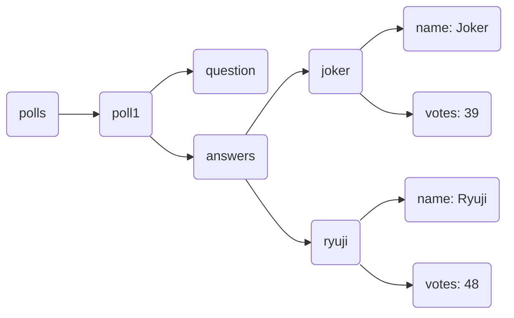

# Polling Widget

## A real-time polling widget about Persona 5

Cast a vote and anyone else looking at the poll on their own device will immediately see your vote reflected. Persona 5 ransom-style letters are randomized and will look different every page load.

## IGN Code Foo 2023

### INTRODUCTION

You can read about how IGN has been with me most of my life and why I'd love to intern there [here](https://github.com/CutlerSheridan/polling-widget/blob/main/question-responses/introduction.md).

### POLLING WIDGET

~~See the deployed page [here](https://cutlersheridan.github.io/polling-widget)~~ , or the raw code in the `/src/` folder.

I think it turned out looking really good, and all the votes are from real people from Reddit. I'm playing Persona 5 Royal right now and thought I'd use that as inspiration. This was my first time integrating a database where data was watched and updated in real-time for all users and it was fun getting everything to work. I also had a really good time analyzing various elements of the game's UI, especially [the pause menu](https://images.gamebanana.com/img/ss/mods/62d1324c5bd85.jpg), and figuring out how to recreate the _feel_ of the game.

I used Firebase for the database. The structure of the data can be gleaned from the code itself, but for facility's sake, it's organized like this:

And so on for all the possible answers.

### HISUI'S NEW POWER PLANT

I've solved this problem as thoroughly as I can with the given information [here](https://github.com/CutlerSheridan/polling-widget/blob/main/question-responses/powerPlant.md).

### BONUS

Take a look at my other project repos [here](https://github.com/cutlersheridan)! Browse the source code or the deployed GitHub Pages if you just want to see the end result. I have [a Todo app](https://cutlersheridan.github.io/todo/) that allows users to sign in with google and track their own tasks, [an I Spy game](https://cutlersheridan.github.io/i-spy/) that fetches the game images, which items to look for, and where those parts of the image are located from a database, and [a Battleship game](https://cutlersheridan.github.io/battleship/) that two people can play or you can play with an AI that will give you a run for your money, amongst other things.

Looking forward to hearing from you!

Cutler Sheridan

---

#### TODO NEXT

- [MAYBE] add localStorage check to see if user has voted before or not (to prevent vote bombing)
  - maybe not though—I like being able to see the pre-submit and post-submit stages of the UI by refreshing; not a huge deal if this particular project has someone submit more than once

#### DONE

_1.1.6_

- make poll radio buttons highlight on hover
- change "more work" button to link to portfolio

_1.1.5_

- update README now that repo is private

_1.1.4_

- update introduction.md

_1.1.3_

- update README

_1.1.2_

- update README

_1.1.1_

- update README

_1.1.0_

- answer Power Plant problem
- write introduction
- spruce up README
- adjust poll tilt

_1.0.4_

- change page title

_1.0.3_

- make "vote/s" singular if only one vote in poll total
- adjust answer vote total min-width

_1.0.2_

- add space between % bar and answer's total votes if bar is at 100%
- make "vote/s" singular if only one vote in answer total

_1.0.1_

- fix % total so, if no votes present, reads 0%, not NaN%

_1.0.0_

- adjust Submit button alignment
- add credit

_0.4.3_

- restructure DOM so answer and respective percent num are grouped and percent bar and num of votes are grouped to allow for more control over horizontal alignment
- adjust totalVotes element size so poll container doesn't resize upon submission

_0.4.2_

- add white border-right to percent bars

_0.4.1_

- tilt See Results button
- make See Results font a stencil with red background
- make Submit button red with black outline when inactive
- make Submit say Submitted when submitted

_0.4.0_

- refactor hasBeenSubmitted into state of Poll to pass down into PollAnswer
- add 'see results' button without voting in place of total vote count in bottom right, then swap with total vote count upon clicking that or submitting a vote

_0.3.5_

- tilt boxes to make it feel more dynamic
- disable submit button before any option is clicked and after submitting answer
- prevent changing answer after submitting

_0.3.4_

- make some letters tilt to a lesser degree
- refactor letter style randomization to be more random
- change text stroke approach for more crisp, thicker outlines

_0.3.3_

- fix letter style randomization so words don't break across lines
- spread the letters out a bit

_0.3.2_

- add random text styling for:
  - capitalization
  - color / outline / background
  - some bigger letters
  - tilt left or right

_0.3.1_

- make text white with black outline by default
- style submit button

_0.3.0_

- disable radio buttons upon voting
- add percent bar under choices
- make percent bar width widen to appropriate width upon voting
- make percent bar only visible after voting

_0.2.1_

- adjust some spacing
- add some borders
- replace default radio buttons with customs

_0.2.0_

- implement real-time data watching for vote totals
- refactor and delete totalVotes field in database; replace with state that tracks total votes via a useEffect watching each answer's vote totals and recalculating total each change

_0.1.0_

- create component files for Poll and PollAnswer
- create firebaseController for database configuration and logic
- create firebase database and structure for question data
- make Poll component that pulls data from firebase and populates question and answer data
- make submit button increment appropriate answer's vote total
- make submit button increment poll's total votes amount

_0.0.0_

- Initial commit
